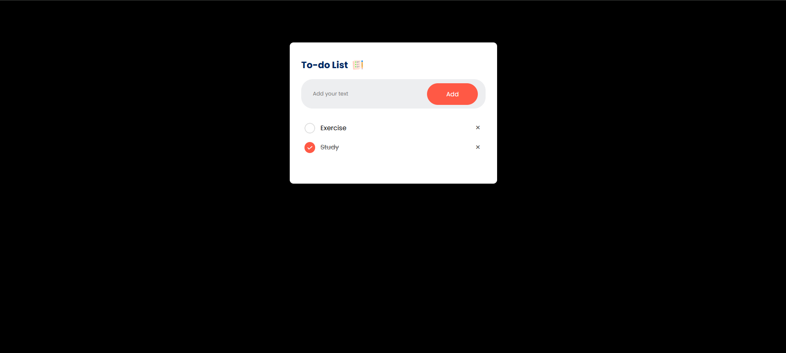

# 📝 To-Do List Web App

A simple and responsive To-Do List web application built using **HTML**, **CSS**, and **JavaScript**. It allows users to:

- ✅ Add new tasks  
- ☑️ Mark tasks as completed  
- 🗑️ Delete tasks  
- 💾 Automatically save tasks using `localStorage`

---

## 🚀 Live Demo

🔗 [[View Project](https://sarthakruge003.github.io/todo-list/) ](https://sarthakruge003.github.io/todo-list/)
*(Replace with your actual GitHub Pages link)*

---

## 📸 Preview

  
*(Add a screenshot of your project here)*

---

## 🛠️ Tech Stack

- HTML5  
- CSS3  
- JavaScript (Vanilla)  
- localStorage for data persistence  

---

## 📁 Features

- Mobile responsive design  
- Dark background with white container UI  
- Clean user interaction with DOM manipulation  
- Works even after refreshing the page  

---

## 📦 Installation

```bash
git clone https://github.com/your-username/todo-list.git
cd todo-list
open index.html
